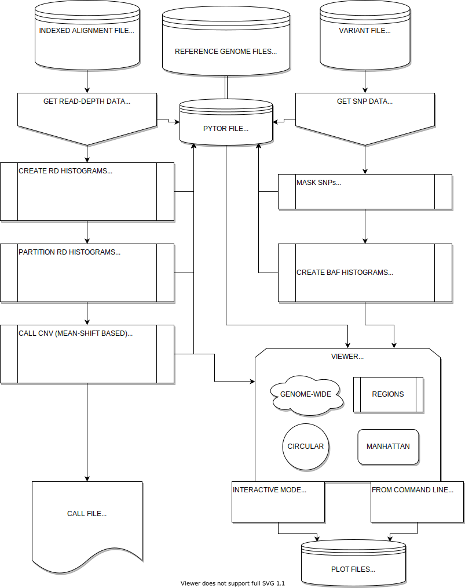

# CNVpytor - a python extension of CNVnator

CNVpytor is a Python package and command line tool for CNV analysis from depth-of-coverage by mapped reads developed in Abyzov Lab, Mayo Clinic.

**NEW: CNVpytor release ver 1.0 is available to install!**

## Learn how to use CNVpytor in 10 minutes

* [Geting started](GettingStarted.md) with command line interface
* [Jupyter notebook](examples/CNVpytor.ipynb): How to use CNVpytor from Python 

## Gallery

| | |
|---|---|
| Manhattan plot ([see example](examples/manhattan.md))| Circular plot ([see example](examples/circular.md))|
|||
| Region plot ([see example](examples/region.md))| Compare regions ([see example](examples/compare.md))|
|||


## Install

### Dependencies

* requests>=2.0
* gnureadline
* pysam>=0.15
* numpy>=1.16
* scipy>=1.1
* matplotlib>=2.2
* h5py>=2.9

Optional:

* pyBigWig - for JBrowse export functionality
* ROOT - for CNVnator root import/export functionality
* seaborn - for additional plotting styles 


### Install by cloning from GitHub

```
> git clone https://github.com/abyzovlab/CNVpytor.git
> cd CNVpytor
> pip install .
```
For single user (without admin privileges) use:
```
> pip install --user .
```

### Install using pip

```
> pip install cnvpytor
> cnvpytor -download
```


## Use as a command line tool



_Diagram made using [Draw.io](https://github.com/jgraph/drawio)._ 

### Call CNVs using read depth:
```
> cnvpytor -root file.pytor -rd file.bam
> cnvpytor -root file.pytor -his 1000 10000 100000
> cnvpytor -root file.pytor -partition 1000 10000 100000
> cnvpytor -root file.pytor -call 1000 10000 100000
```

### Importing and using single nucleotide polymorphism data:
```
> cnvpytor -root file.pytor -snp file.vcf
> cnvpytor -root file.pytor -pileup file.bam
> cnvpytor -root file.pytor -baf 10000 100000
```

### Plot from command line
```
> cnvpytor -root file.pytor -plot rdstat
> cnvpytor -root file.pytor -plot rd 10000 100000
> cnvpytor -root file.pytor -plot rdstat manhattan 100000 -o prefix.pdf
> cnvpytor -root file.pytor -plot baf 100000 
> cnvpytor -root file.pytor -plot regions 1:10M-20M,2:20M-43M 3:10M-20M 10000
> cnvpytor -root file.pytor -plot circular 100000 -use_mask_rd -o prefix.png
```

### Plot from interactive mode

CNVpytor view interactive mode is implemented with **<tab> completion** and internal documentation (**help** command).

To enter interactive mode use '-view bin_size' option:

```
> cnvpytor -root file.pytor -view 10000
cnvpytor> chr1:1M-50M
cnvpytor> rd
cnvpytor> set panels rd likelihood
cnvpytor> show
Parameters
    * baf_colors: ['gray', 'black', 'red', 'green', 'blue']
    * bin_size: 100000
    * chrom: []
    * contrast: 20
    * dpi: 200
    * file_titles: []
    * grid: auto
    * lh_colors: ['yellow']
    * markersize: auto
    * min_segment_size: 0
    * output_filename: 
    * panels: ['rd']
    * plot_file: 0
    * plot_files: [0]
            0: file.pytor
    * rd_call: True
    * rd_call_mosaic: False
    * rd_circular_colors: ['#555555', '#aaaaaa']
    * rd_colors: ['grey', 'black', 'red', 'green', 'blue']
    * rd_manhattan_call: False
    * rd_manhattan_range: [0, 2]
    * rd_partition: True
    * rd_range: [0, 3]
    * rd_raw: True
    * rd_use_gc_corr: True
    * rd_use_mask: False
    * snp_call: False
    * snp_circular_colors: ['#00ff00', '#0000ff']
    * snp_colors: ['yellow', 'orange', 'cyan', 'blue', 'lime', 'green', 'yellow', 'orange']
    * snp_use_id: False
    * snp_use_mask: True
    * snp_use_phase: False
    * style: None
    * xkcd: False

cnvpytor> help markersize

markersize
    Size of markers used in scatter like plots (e.g. manhattan, snp).

TYPE
    float or str

DEFAULT
    auto

PLOTS AFFECTS
    manhattan, snp, region plot with snp panel

EXAMPLE(s)
    set markersize 10
    set markersize auto

SEE ALSO
    rd_colors, snp_colors, baf_colors, lh_colors

cnvpytor> set bin_size 100000
cnvpytor> chr1:1M-50M chr2:60M-65M > filename.png
```

## Use as a Python package

CNVpytor is not just command line tool but also Python package. 

For more details check [API Documentation](https://abyzovlab.github.io/CNVpytor/) or 
see examples in [Jupyter notebook](examples/CNVpytor.ipynb).


## Export
### 1. CNVpytor data visualization using JBrowse
#### JBrowse version and plugins
JBrowse version: https://github.com/GMOD/jbrowse/archive/1.16.6-release.tar.gz

 Plugins: 
 - multibigwig (https://github.com/elsiklab/multibigwig )
 - multiscalebigwig (https://github.com/cmdcolin/multiscalebigwig)

**Note:** The JBrowse development version is required as integration of different jbrowse plugins are needed.

#### Usage
To generate cnvpytor file for JBrowse visualization:
```
cnvpytor -root [pytor files] -export jbrowse [optional argument: output path]

Default export directory name: 
 - For single pytor file input:  jbrowse_[pytor file name]
 - For multiple pytor file input: cnvpytor_jbrowse_export
```
The above command creates all the necessary files that are required to visualize the cnvpytor data. 

To view cnvpytor file using JBrowse, users need to install JBrowse and required plugins (See JBrowse version and plugins section).
`
http://localhost/jbrowse/?data=[export directory] 
`

``` 
# Example usage
cnvpytor -root test.pytor -export jbrowse
http://localhost/jbrowse/?data=jbrowse_test
```

#### Data Description
There are mainly two types of data cnvpytor processes. i.e.; Read depth data from alignment file and SNP data from variant file. Depending on the availability of these two input data, the export function works.

For Read depth data, it exports Raw segmented RD, GC corrected Raw Segmented RD, GC corrected RD partition, CNV calling using RD . All of these Read depth signals are plotted on top of each other on a single horizontal track using color gray, black, red and green respectively.
For SNP data, it exports Binned BAF, Likelihood of the binned BAF signals. These two signals are plotted on top of each other with gray and red color.

<p align="center"></p>
<table>
    <thead>
        <tr>
            <th align="left">Data</th>
            <th align="center">Signal name with color on JBrowse </th>
        </tr>
    </thead>
    <tbody>
        <tr>
            <td align="left">Read Depth (RD)</td>
            <td align="left">Raw Segmented RD (Gray) <br>GC Corrected Raw Segmented RD (Black) <br> GC corrected RD partition (Red) <br> CNV call using RD signals (Green)</td>
        </tr>
        <tr>
            <td align="left">SNP</td>
            <td align="left">Binned BAF (Gray) <br> Likelihood of the Binned BAF (Red)</td>
        </tr>
    </tbody>
</table>
<p></p>

cnvpytor does the segmentation for all of the above data based on the user provided bin size. The multiscalebigwig provides the option to show the data based on the visualized area on the reference genome, which means if a user visualizes a small region of the genome it shows small bin data and vice versa.           
## Bugs

Please report any bugs that you find on GitHub:
https://github.com/abyzovlab/CNVpytor/issues

Or, even better, fork the repository on GitHub and create a pull request.

## License

Released under MIT licence.


